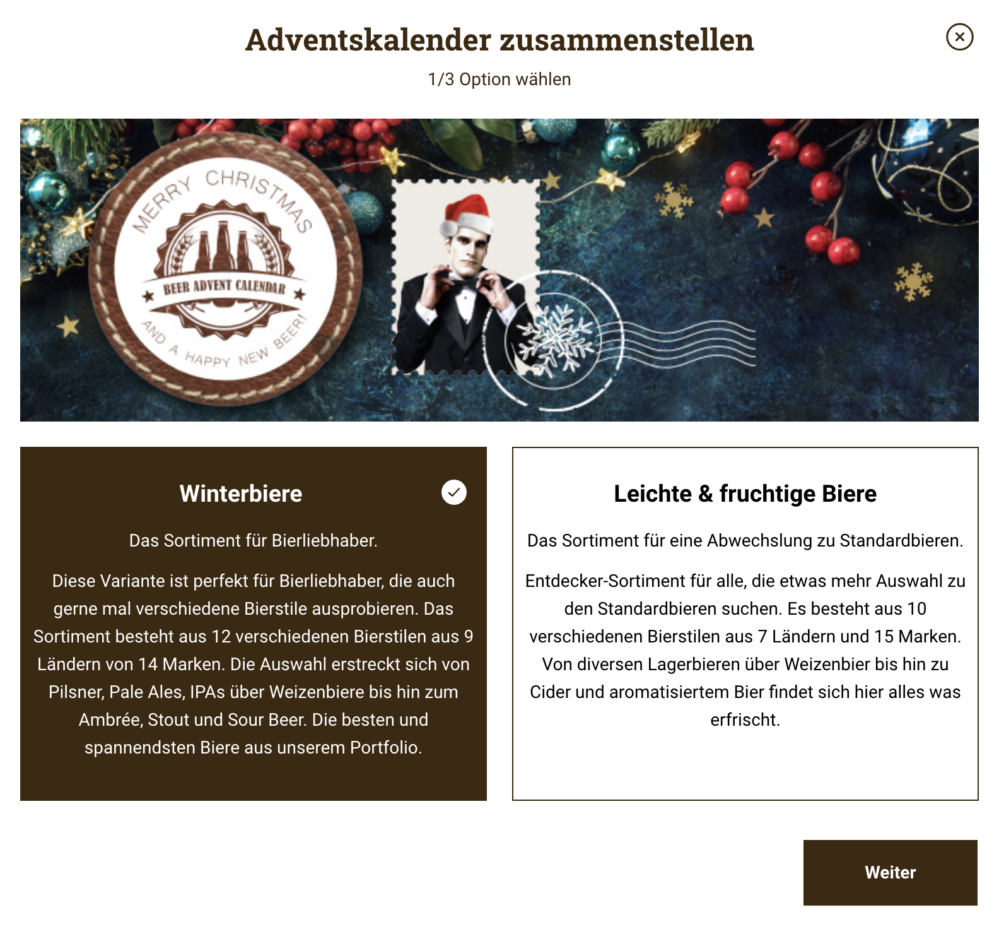

# 05 - create a basic frontend

## Mission
Create a new frontend project with react, typescript and tailwindcss. After setup create a basic page with static values as seen in the following screenshot.

The image is attached in this repo and the text can be hardcoded. If you press on the right square the selection should change from "Winterbiere" to "Leichte & Fruchtige Biere". 

## Input
Open the browser on https://localhost:3000

## Expected Output
The above Screenshot coded in react, typescript and tailwindcss